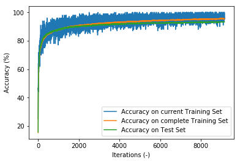

# Lesson 0016 - MNIST Classification Deep Neural Network (II)
In [lesson 0014](https://github.com/Mathhead/Lessons-in-Machine-Learning/blob/master/lesson_0014_mnist_classification_neural_network.ipynb) we created our first neural network. In [lesson 0015](https://github.com/Mathhead/Lessons-in-Machine-Learning/blob/master/lesson_0015_mnist_classification_deep_neural_network.ipynb) we tried to improve the performance by making the network deeper, but the deeper network did not perform so well.<br>
This time, we will try a deep neural network with only $2$ hidden layers.<br>
For this, we will steal code from [lesson 0015](https://github.com/Mathhead/Lessons-in-Machine-Learning/blob/master/lesson_0015_mnist_classification_deep_neural_network.ipynb).


```python
import tensorflow as tf

tf.set_random_seed( 1234567890 )

print( tf.__version__ )
```

    1.13.1
    


```python
( train_x, train_y ),( test_x, test_y ) = tf.keras.datasets.mnist.load_data()
```


```python
import numpy as np

np.random.seed( 1234567890 )

print( np.__version__ )
```

    1.16.2
    


```python
import matplotlib
import matplotlib.pyplot as plt

print( matplotlib.__version__ )
```

    3.0.3
    


```python
mu = np.mean( train_x )

sigma = np.std( train_x )


train_x = ( train_x - mu ) / sigma

test_x = ( test_x - mu ) / sigma
```


```python
train_x_f = np.zeros( shape = [ 60000, 28 * 28 ] )

train_y_f = np.zeros( shape = [ 60000, 10 ] )

test_x_f = np.zeros( shape = [ 10000, 28 * 28 ] )

test_y_f = np.zeros( shape = [ 10000, 10 ] )


for i in range( 60000 ):
    
    train_y_f[ i, train_y[ i ] ] = 1.0
    
    
for i in range( 10000 ):
    
    test_y_f[ i, test_y[ i ] ] = 1.0
    

for i in range( 60000 ):
    
    dummy = np.array( train_x[ i ] )
    
    train_x_f[ i, : ] = dummy.flatten()
    
    
for i in range( 10000 ):
    
    dummy = np.array( test_x[ i ] )
    
    test_x_f[ i ] = dummy.flatten()
    
    
    
    
train_x = train_x_f

train_y = train_y_f

test_x = test_x_f

test_y = test_y_f
```

We will create a neural network with $28*28$ nodes in the first hidden layer, and $512$ neurons in the second hidden layer. As in [lesson 0015](https://github.com/Mathhead/Lessons-in-Machine-Learning/blob/master/lesson_0015_mnist_classification_deep_neural_network.ipynb), we will use the leaky ReLu activation function.<br>
We will train with $100$ randomly drawn training data for $20000$ iterations with a learning rate of $0.001$.


```python


x_tf = tf.placeholder( tf.float32, shape = [ None, 28 * 28 ] )

y_tf = tf.placeholder( tf.float32, shape = [ None, 10 ] )


W_tf_1 = tf.Variable( tf.truncated_normal( [ 28 * 28, 28 * 28 ] ) )

b_tf_1 = tf.Variable( tf.truncated_normal( [ 28 * 28 ] ) )

layer_2 = tf.nn.leaky_relu( tf.matmul( x_tf, W_tf_1 ) + b_tf_1 )


W_tf_2 = tf.Variable( tf.truncated_normal( [ 28 * 28, 512 ] ) )

b_tf_2 = tf.Variable( tf.truncated_normal( [ 512 ] ) )

layer_3 = tf.nn.leaky_relu( tf.matmul( layer_2, W_tf_2 ) + b_tf_2 )


W_tf_3 = tf.Variable( tf.truncated_normal( [ 512, 10 ] ) )

b_tf_3 = tf.Variable( tf.truncated_normal( [ 10 ] ) )

layer_4 = tf.nn.leaky_relu( tf.matmul( layer_3, W_tf_3 ) + b_tf_3 )


cross_entropy = tf.reduce_mean( tf.nn.softmax_cross_entropy_with_logits_v2( logits = layer_4, labels = y_tf ) )


gd = tf.train.GradientDescentOptimizer( 0.001 ).minimize( cross_entropy )


hit = tf.equal( tf.argmax( layer_4, 1 ), tf.argmax( y_tf, 1 ) )


accuracy = 100 * tf.reduce_mean( tf.cast( hit, tf.float32 ) )


```

    WARNING:tensorflow:From C:\Users\rhopi\Anaconda3\lib\site-packages\tensorflow\python\framework\op_def_library.py:263: colocate_with (from tensorflow.python.framework.ops) is deprecated and will be removed in a future version.
    Instructions for updating:
    Colocations handled automatically by placer.
    


```python
sess = tf.Session()


progress_train = []

progress_train_current = []

progress_test = []
 
    
    
    
    
sess.run( tf.global_variables_initializer() )


for i in range( 20000 ):
                
    random_integers = np.random.choice( range( 60000 ), 100, replace = False )
                
    local_x = train_x[ random_integers, : ]
    
    local_y = train_y[ random_integers, : ]
        
    sess.run( gd, feed_dict = { x_tf : local_x, y_tf : local_y } )
        
    progress_train.append( sess.run( accuracy, feed_dict = { x_tf : train_x, y_tf : train_y } ) )
        
    progress_train_current.append( sess.run( accuracy, feed_dict = { x_tf : local_x, y_tf : local_y } ) )
        
    progress_test.append( sess.run( accuracy, feed_dict = { x_tf : test_x, y_tf : test_y } ) )
```


    ---------------------------------------------------------------------------

    KeyboardInterrupt                         Traceback (most recent call last)

    <ipython-input-8-2b3e204a1f3b> in <module>
         32     sess.run( gd, feed_dict = { x_tf : local_x, y_tf : local_y } )
         33 
    ---> 34     progress_train.append( sess.run( accuracy, feed_dict = { x_tf : train_x, y_tf : train_y } ) )
         35 
         36     progress_train_current.append( sess.run( accuracy, feed_dict = { x_tf : local_x, y_tf : local_y } ) )
    

    ~\Anaconda3\lib\site-packages\tensorflow\python\client\session.py in run(self, fetches, feed_dict, options, run_metadata)
        927     try:
        928       result = self._run(None, fetches, feed_dict, options_ptr,
    --> 929                          run_metadata_ptr)
        930       if run_metadata:
        931         proto_data = tf_session.TF_GetBuffer(run_metadata_ptr)
    

    ~\Anaconda3\lib\site-packages\tensorflow\python\client\session.py in _run(self, handle, fetches, feed_dict, options, run_metadata)
       1150     if final_fetches or final_targets or (handle and feed_dict_tensor):
       1151       results = self._do_run(handle, final_targets, final_fetches,
    -> 1152                              feed_dict_tensor, options, run_metadata)
       1153     else:
       1154       results = []
    

    ~\Anaconda3\lib\site-packages\tensorflow\python\client\session.py in _do_run(self, handle, target_list, fetch_list, feed_dict, options, run_metadata)
       1326     if handle is None:
       1327       return self._do_call(_run_fn, feeds, fetches, targets, options,
    -> 1328                            run_metadata)
       1329     else:
       1330       return self._do_call(_prun_fn, handle, feeds, fetches)
    

    ~\Anaconda3\lib\site-packages\tensorflow\python\client\session.py in _do_call(self, fn, *args)
       1332   def _do_call(self, fn, *args):
       1333     try:
    -> 1334       return fn(*args)
       1335     except errors.OpError as e:
       1336       message = compat.as_text(e.message)
    

    ~\Anaconda3\lib\site-packages\tensorflow\python\client\session.py in _run_fn(feed_dict, fetch_list, target_list, options, run_metadata)
       1317       self._extend_graph()
       1318       return self._call_tf_sessionrun(
    -> 1319           options, feed_dict, fetch_list, target_list, run_metadata)
       1320 
       1321     def _prun_fn(handle, feed_dict, fetch_list):
    

    ~\Anaconda3\lib\site-packages\tensorflow\python\client\session.py in _call_tf_sessionrun(self, options, feed_dict, fetch_list, target_list, run_metadata)
       1405     return tf_session.TF_SessionRun_wrapper(
       1406         self._session, options, feed_dict, fetch_list, target_list,
    -> 1407         run_metadata)
       1408 
       1409   def _call_tf_sessionprun(self, handle, feed_dict, fetch_list):
    

    KeyboardInterrupt: 


```python
sess.close()
```


```python
plt.plot( progress_train_current, label = 'Accuracy on current Training Set' )

plt.plot( progress_train, label = 'Accuracy on complete Training Set' )

plt.plot( progress_test, label = 'Accuracy on Test Set' )

plt.legend( loc = 'best' )

plt.xlabel( 'Iterations (-)' )

plt.ylabel( 'Accuracy (%)' )
```


    Text(0, 0.5, 'Accuracy (%)')




